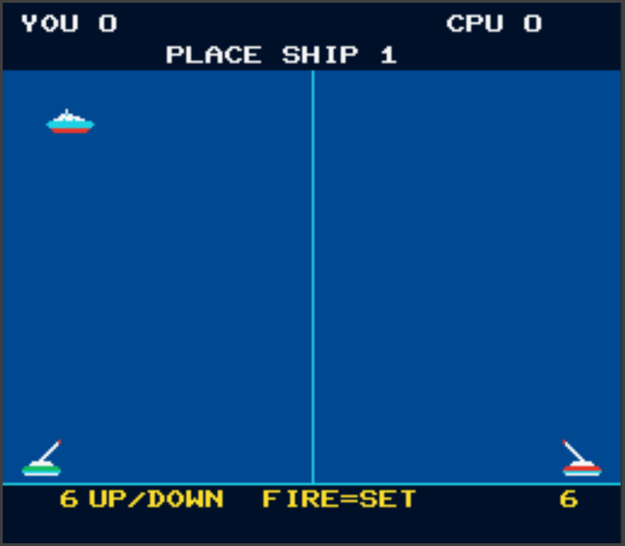
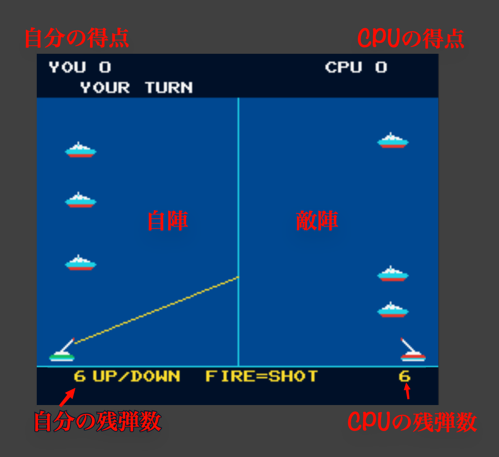
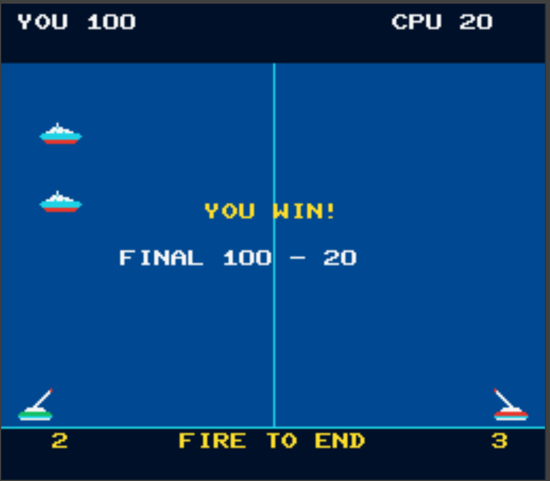

# 魚雷戦ゲーム on MachiKKania

MachiKaniaで動作する魚雷戦ゲームで、CPUと対戦します。

# 導入方法

GYORAI.BASをダウンロードしてSDカードにコピーします。

# 起動方法

MachiKania起動後、SDカードに保存されたGYORAI.BASをロードし、`F4`キーでRUNします。

# 遊び方

1. プログラムが起動したら自分の戦艦を3隻配置します。`UP`および`DOWN`ボタンで位置を決め、`FIRE`ボタンで配置されます。
2. 自分の戦艦配置し終えるとゲームが始まります。人間、CPUの順で相手を攻撃します。人間が左、CPUが右側になります。![ゲーム画面]
3. UPおよびDOWNボタンで魚雷の発射方向を決め、FIREボタンで発射します。弾数は6発です。残弾数は自分の砲台の下に表示されます。
4. 魚雷を6発撃ち終えて点数が高い方、あるいは先に100点を取った方が勝ちです。
5. `FIRE`ボタンで実行画面を抜けます。
