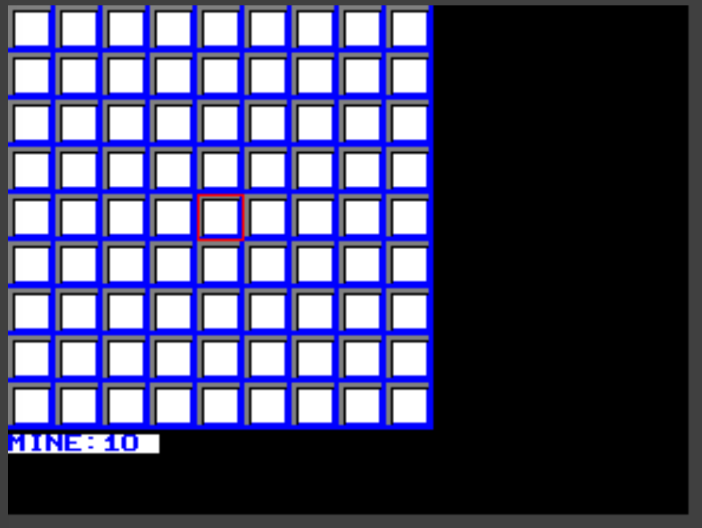
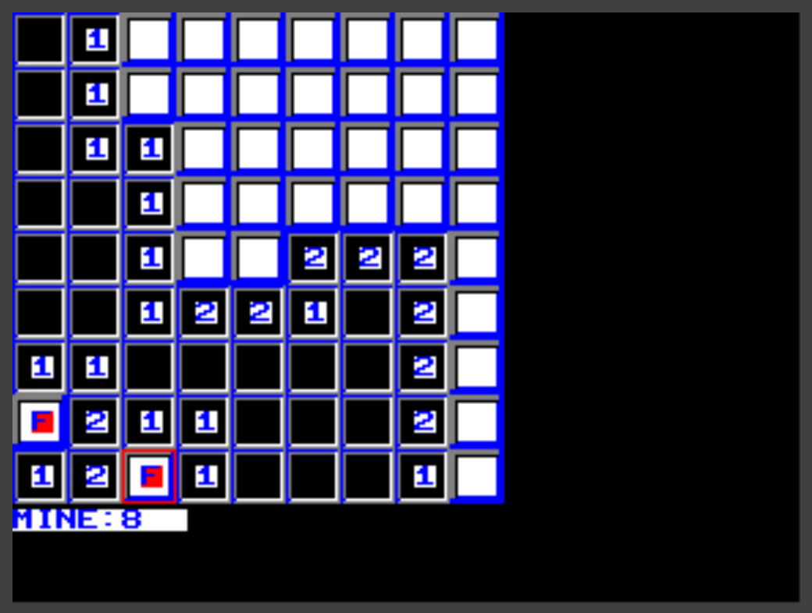
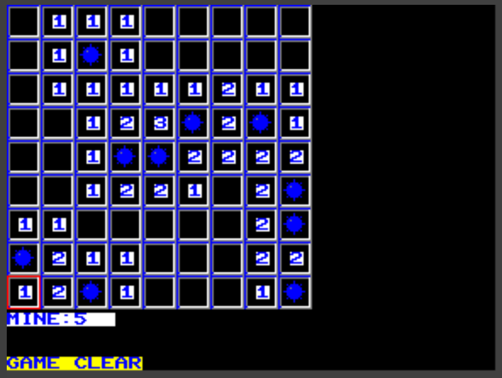
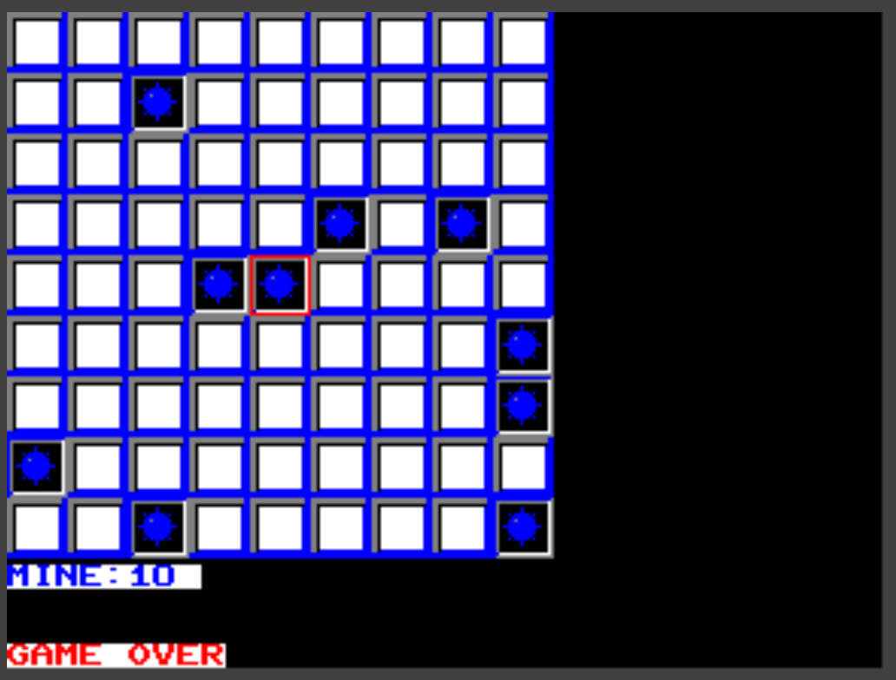

# マインスイーパー on MachiKania

MachiKaniaのKM-BASICで動作するマインスイーパーです。

盤面に隠された地雷を踏まないようにマス目を開けていきます。地雷を踏まずに安全なマス目を全て開けられたらゲームクリアです。

## 導入方法

ファイルMINESWEE.BASをダウンロードし、SDカードにコピーします。

## 起動方法

MachiKaniaを起動後、SDカードからMINESWEE.BASをロードし、実行します。

実行すると9×9のマス目が表示され、中央のマス目に赤枠のカーソルが表示されます。
盤面の下には地雷の残り数が表示されます。地雷は全部で10個あり、地雷があると判断したマス目に置いた旗数を引かれた数になります。

## 操作方法

- UP、DOWN、LEFT、RIGHTボタンあるいはキーボードのカーソルキーで赤枠を動かします。
- 地雷がないと思われる場所で`FIRE`ボタンあるいは`F`キーを押すと赤枠のマス目が開きます。
- 地雷があると思われるマス目で`START`ボタンあるいは`S`キーを押すと目印の旗が置かれます。旗を置いたマス目は開けることができません。

ゲームの過程

ゲームクリア

ゲームオーバー

